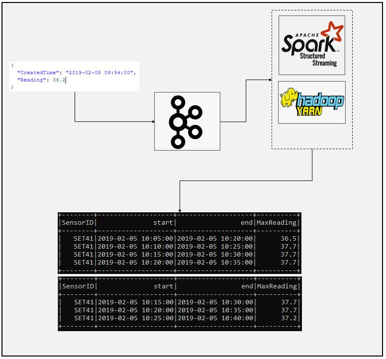

# SparkStream Kafka Sliding Window Example
### Dataflow Pipeline


### Summary

This is kafka source and console sink sliding window example. In this application maximum sensor values from temperature sensors will be calculated in given event time window interval. Windows will be overlapping which means we will need to use sliding window configuration.

### Task List

- [x] Create kafka topics
```
/home/enes/Software/kafka_2.12-2.7.0/bin/kafka-topics.sh --create --zookeeper localhost:2181 --replication-factor 1 --partitions 1 --topic sensor
```
- [x] Check sample data

```json
{
  "CreatedTime": "2019-02-05 09:54:00",
  "Reading": 36.2
}
```
- [x] Create spark session (You can use ".master("local[*])" instead of yarn if you are running Spark on standalone mode")
```
# Create spark session and set configurations, here we set yarn, because we want to run spark application on hadoop environment
    spark = SparkSession \
        .builder \
        .appName("Sliding Window Steram") \
        .master("yarn") \
        .config("spark.streaming.stopGracefullyOnShutdown", "true") \
        .config("spark.sql.shuffle.partitions", 1) \
        .getOrCreate()
```
- [x] Define schema
```
# Define schema for kafka data
# Schema will be used during deserialization of kafka data
    stock_schema = StructType([
        StructField("CreatedTime", StringType()),
        StructField("Reading", DoubleType())
    ])
```
- [x] Read data from kafka source
```
# Read data from kafka topic
    kafka_source_df = spark.readStream \
        .format("kafka") \
        .option("kafka.bootstrap.servers", "localhost:9092") \
        .option("subscribe", "sensor") \
        .option("startingOffsets", "earliest") \
        .load()

```
- [x] Deserialize kafka data, note that data contains key value besides json structure, we need to both deal with key and value data seperately.
```
# Deserialization
    value_df = kafka_source_df.select(col("key").cast("string").alias("SensorID"),
                                      from_json(col("value").cast("string"), stock_schema).alias("value"))
```

- [x] Apply transformations
```
# Select both key and all values, convert time from string type to timestamp
    sensor_df = value_df.select("SensorID", "value.*") \
        .withColumn("CreatedTime", to_timestamp(col("CreatedTime"), "yyyy-MM-dd HH:mm:ss"))

```
- [x] Set 15 minutes window interval with 5 minutes sliding time and 30 minutes watermark, aggregate data to find maximum temperature
```
# Aggregate to find maximum temperature for given window interval
# Set 5 minut slide
    agg_df = sensor_df \
        .withWatermark("CreatedTime", "30 minute") \
        .groupBy(col("SensorID"),
                 window(col("CreatedTime"), "15 minute", "5 minute")) \
        .agg(max("Reading").alias("MaxReading"))
```
- [x] Create output dataset and write results onto console
```
# Create output dataset
    output_df = agg_df.select("SensorID", "window.start", "window.end", "MaxReading")

# Write result to console in update mode
    window_query = output_df.writeStream \
        .format("console") \
        .outputMode("update") \
        .option("checkpointLocation", "Sensor/chk-point-dir") \
        .trigger(processingTime="1 minute") \
        .start()

    window_query.awaitTermination()
```

### Code Description

spark_kafka_sliding_window.py is spark script to read data from kafka source and make desired transformations, setting sliding window interval as well as writing data onto console.

### Running

1. Create kafka topics

2. Run kafka-console producer
```
/home/enes/Software/kafka_2.12-2.7.0/bin/kafka-console-producer.sh --broker-list localhost:9092 --topic sensor --property "parse.key=true" --property "key.separator=:"
```
3. Enter sample data
```json
{
  "CreatedTime": "2019-02-05 10:29:00",
  "Reading": 37.2
}
```
4. Submit spark script
```
spark-submit --packages org.apache.spark:spark-sql-kafka-0-10_2.12:3.0.1 spark_kafka_sliding_window.py
```
5. Check the result
